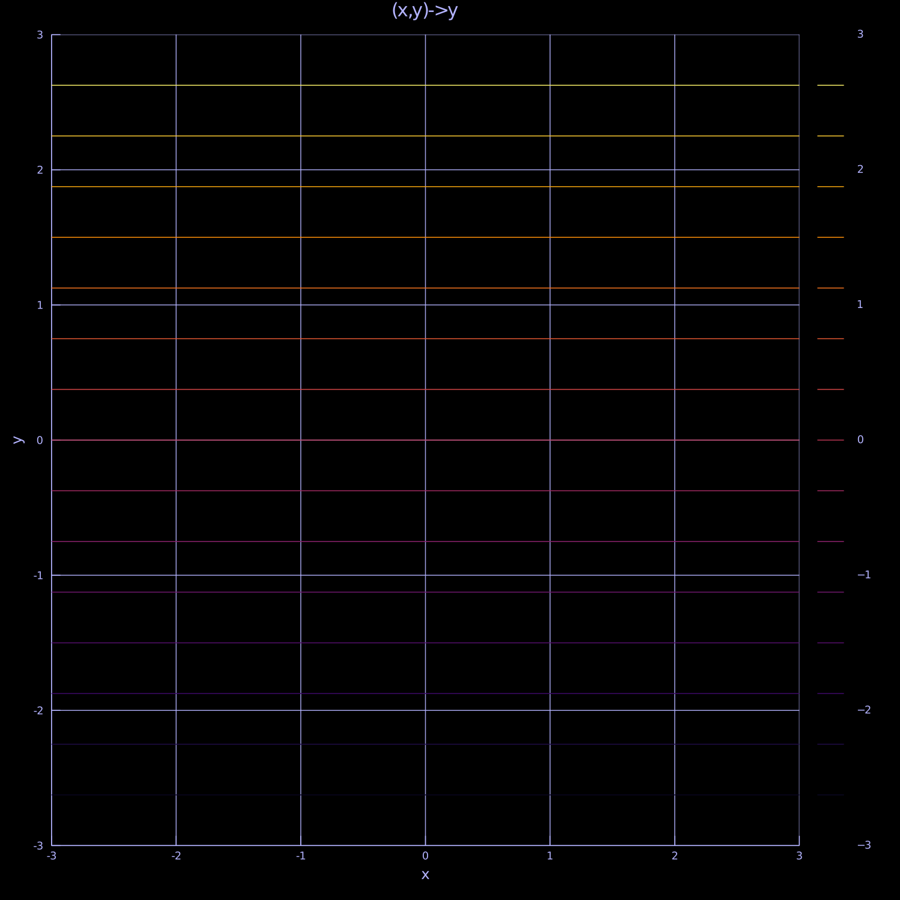
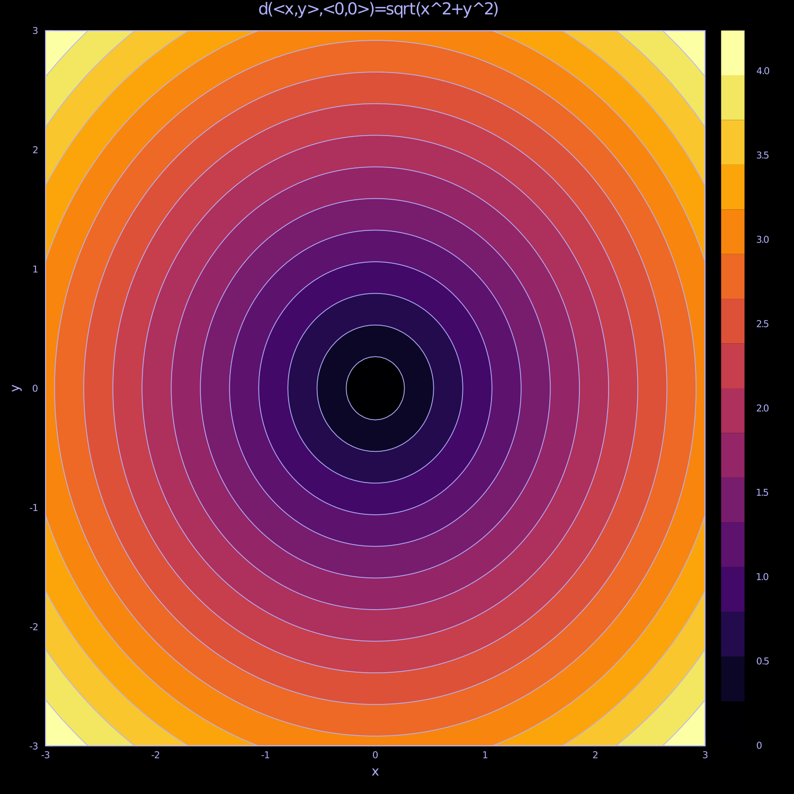
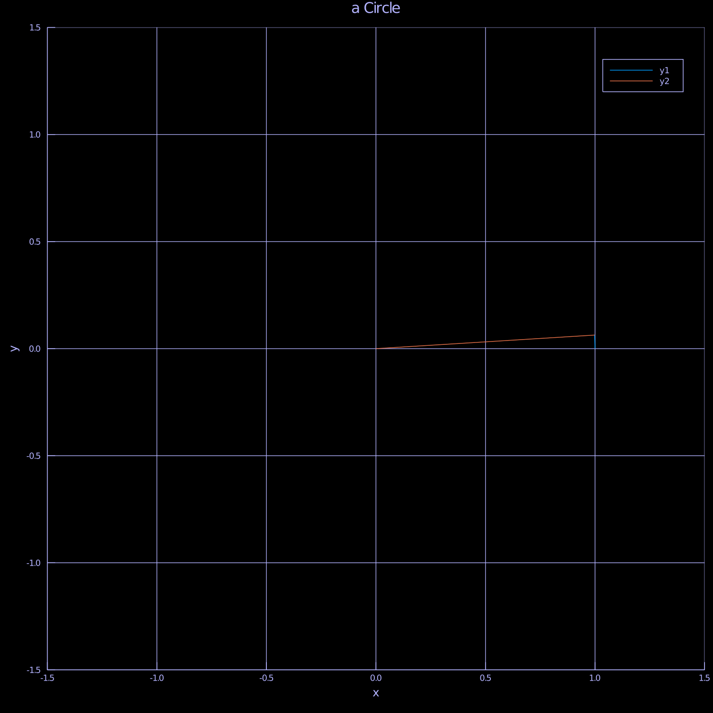

```julia
cd("D:/animated-adventure-in-mathematics/ConicalCurvesNContours")
include("D:/animated-adventure-in-mathematics/themes.jl");
using Plots
```


# A Mesh
Consider
$$
f: \R^2 \rightarrow \R
$$

```julia
xb = -3:.05:3
yb = -3:.05:3
zlim = [-5,5]

Plots.contour!(theme_default(),xb,yb,[x for y in yb,x in xb],title = "(x,y)->x")
Plots.contour!(theme_default(),xb,yb,[y for y in yb,x in xb],title = "(x,y)->y")
```




## z = d(<x,y>,<0,0>)

Recall:
In \(\R^2\) we can have
$$
d((x,y),(0,0)) =\sqrt{x^2+y^2}
$$

Plot the contour of distance form the origin:

```julia

m = [sqrt(x^2+y^2) for x in xb, y in yb];

Plots.contour!(theme_default(), xb,yb,m,fill = m,title = " d(<x,y>,<0,0>)=sqrt(x^2+y^2)")
```




Compare with (x,y) → x^2+y^2. Both >0,and the contour have same shape but different values

```julia

m = [x^2+y^2 for x in xb, y in yb];
Plots.contour!(theme_default(), xb,yb,m,fill = m,title = " (x^2+y^2)")
savefig("xSqrySqr.png")
```


### From x^2+y^2 to x^2-y^2

Consider
$$
x^2+a*y^2;a\geq -2;a \leq 2
$$


```julia
anm = @animate for a in -2:.04:2
    m = [x^2 + a*y^2 for y in yb,x in xb]
    Plots.contour!(theme_default(),xb,yb,m,fill = m,title = "Contour of x^2+$a *y^2")
end
gif(anm,"EllipseCircleHyperbolic.gif")
anm
```

```
Plots.Animation("C:\\Users\\lhrcp\\AppData\\Local\\Temp\\jl_R4qWkJ", ["0000
01.png", "000002.png", "000003.png", "000004.png", "000005.png", "000006.pn
g", "000007.png", "000008.png", "000009.png", "000010.png"  …  "000092.png"
, "000093.png", "000094.png", "000095.png", "000096.png", "000097.png", "00
0098.png", "000099.png", "000100.png", "000101.png"])
```


## To draw a Circle & an ellipse from a String

```julia
theta = range(0,2*pi,length = 100)
anm = @animate for i in 2:length(theta)
    Plots.plot!(theme_default(),cos.(theta[1:i]),sin.(theta[1:i]),xlim = (-1.5,1.5),ylim = (-1.5,1.5))
    Plots.plot!([0,cos(theta[i])],[0,sin(theta[i])],title = "a Circle")
end
gif(anm,"drawCircle.gif")
```

```
Plots.AnimatedGif("D:\\animated-adventure-in-mathematics\\ConicalCurvesNCon
tours\\drawCircle.gif")
```





```julia
cd("D:/animated-adventure-in-mathematics/")
```

