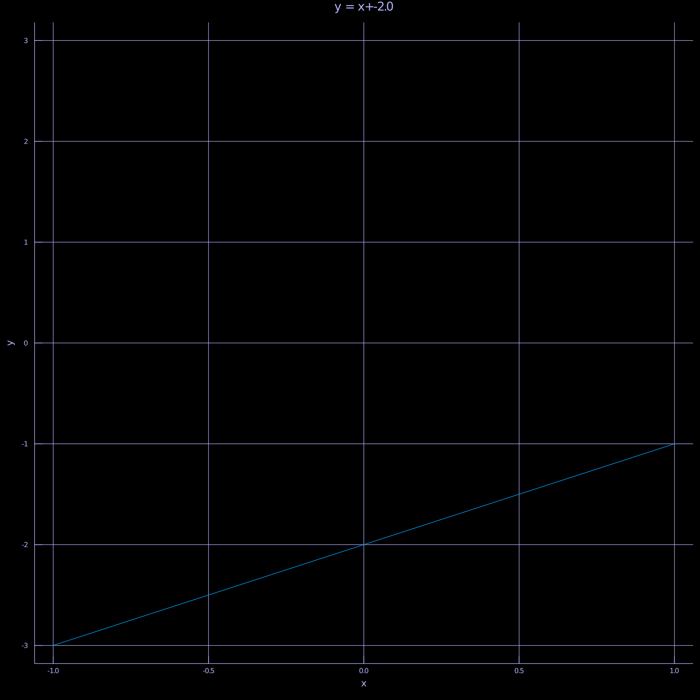

​

# Linear Functions

## Linear Functions


```julia

cd("D:/animated-adventure-in-mathematics/ElementaryFnTrans")

include("D:/animated-adventure-in-mathematics/themes.jl");
using Plots
#mkdir("ElementaryFnTrans")
theme = theme_dark
```

```
theme_dark (generic function with 1 method)
```


x->x+1
x->2*x-1
x->(1/2*x+2)

```julia

gr()
p=Plots.plot!(theme(),x->x,xlim = (-3,3))
p=Plots.plot!(p,x->x+1)
p=Plots.plot!(p,x->2*x-1)
p=Plots.plot!(p,x->(1/2*x+2))
savefig("linearFunctions.png")
p
```


## Linear Function with Variating Gradients


x → ax

```julia
p = Plots.plot!(theme(),size = [1200,1200],xlims = [-1,1])
@time for a in -2:.02:2
    Plots.plot!(x-> x*a,key=false)
end
p = Plots.title!("y=ax, a∈[-2,2]")
savefig(p,"linearGradients.png")
p
```

```
0.609393 seconds (2.34 M allocations: 119.054 MiB, 3.21% gc time)
```


For a ∈ [-2,2], plot f:x→ax

```julia
p = Plots.plot!(theme(),size = [1200,1200],xlims = [-1,1])
#p
anm = @animate for a in -2:.05:2
    
    Plots.plot!(x-> x*a,key=false,xlims = [-1,1],ylims = [-1,1])
    a=round(a,digits=3)
    Plots.title!("y = $a *x")
end
gif(anm,"linearGradients.gif")
```

```
Plots.AnimatedGif("D:\\animated-adventure-in-mathematics\\ElementaryFnTrans
\\linearGradients.gif")
```


## linear Functions with Variating Intecepts

x→ x+a

```julia
p = Plots.plot!(theme(),size = [1200,1200],xlims = [-1,1])
@time for a in -2:.02:2
    Plots.plot!(x-> x+a,key=false)
end
p = Plots.title!("y=x+a, a∈[-2,2]")
savefig(p,"linearIntercepts.png")
p
```

```
0.458530 seconds (1.47 M allocations: 76.047 MiB, 4.57% gc time)
```


For a ∈ [-2,2], plot f:x→x+a

```julia
p = Plots.plot!(theme(),size = [1200,1200],xlims = [-3,3])
#p
anm = @animate for a in -2:.05:2
    
    Plots.plot!(x-> x+a,key=false,xlims = [-1,1],ylims = [-3,3])
    a=round(a,digits=3)
    Plots.title!("y = x+$a")
end
gif(anm,"linearIntercepts.gif")
```

```
Plots.AnimatedGif("D:\\animated-adventure-in-mathematics\\ElementaryFnTrans
\\linearIntercepts.gif")
```




## Quadratic curves

f:x→ ax^2+bx+c
f:x→ a(x-h)^2+k
$$
f:x\rightarrow a(x-x_1)(x-x_2)
$$

$$
f:x\rightarrow a(x-x_{h1})(x-x_{h2})+H
$$


## a = 1/i or -1/i, concavity

```julia
p2 = Plots.plot!(theme(),xlim = (-2,2))
for i in 1:25
    Plots.plot!(x->x^2/i)
end
Plots.title!("x-> (1/ i) *(x^2);i in 1:25")
savefig(p2,"xSqrDivByi.png")
p2
```


```julia
p2 = Plots.plot!(theme(),xlim = (-2,2))
for i in 1:25
    Plots.plot!(x->-x^2/i)
end
Plots.title!("x->  - (1/ i) *(x^2);i in 1:25")
savefig(p2,"-xSqrDivByi.png")
p2
```


```julia

p2 = Plots.plot!(theme(),xlim = (-3,3))
anm = @animate for i in 1:25
    Plots.plot!(x->x^2/i,key = false)
    Plots.title!("x-> (1/ $i) *(x^2)",key = false)
end


gif(anm,"xSqrDivByi.gif")
```

```
Plots.AnimatedGif("D:\\animated-adventure-in-mathematics\\ElementaryFnTrans
\\xSqrDivByi.gif")
```


## 2 Pts soln.

x→x(x-x0);x0∈[-2,2]

```julia
Plots.plot!(theme(),xlim = (-3,3),ylim = (-5,5))
anm = @animate for x0 in -2:.05:2
    Plots.plot!(x-> x*(x-x0))
    Plots.title!("x-> x*(x-x0)")
end
gif(anm,"quadxIntercepts.gif")
```

```
Plots.AnimatedGif("D:\\animated-adventure-in-mathematics\\ElementaryFnTrans
\\quadxIntercepts.gif")
```


```julia
#test
anm = @animate for x0 in -2:.05:2
    Plots.plot!(theme(),x-> x*(x-x0),xlim = (-3,3),ylim = (-5,5),markeralpha = .5)
    Plots.title!("x-> x*(x-$x0)")
    #Plots.vline!(x0/2.)
end
gif(anm,"quadxIntercepts.gif")
```

```
Plots.AnimatedGif("D:\\animated-adventure-in-mathematics\\ElementaryFnTrans
\\quadxIntercepts.gif")
```


## Quadratic Focus & relations

TO DO

# Power Functions

```julia
p3 = Plots.plot(theme();xlims = (-1.5,1.5))
for i in .1:.1:4
    Plots.plot!(p3,x->x^i,ylims = (-10,10))
end
savefig(p3,"Powers.png")
p3
```


## Exponential Functions, Derivatives and Fractional Derivatives


```julia
p4 = Plots.plot(theme();xlims = (-1.5,1.5))
for a in .1:.1:4
    Plots.plot!(p3,x->exp(a*x),key = false)
end
savefig(p4,"Exponential.png")
p4
```


```julia
cd("D:/animated-adventure-in-mathematics/")
```

